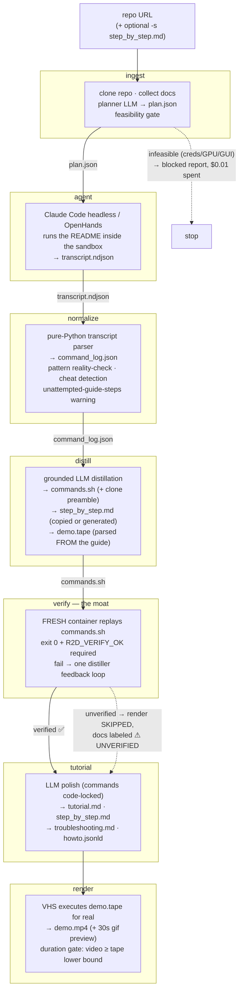
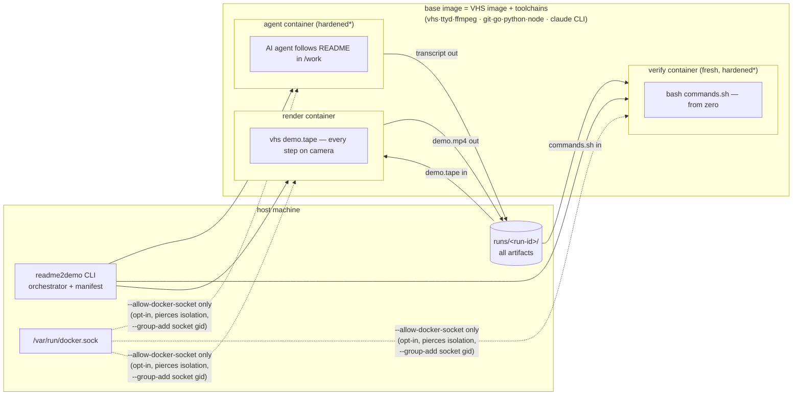
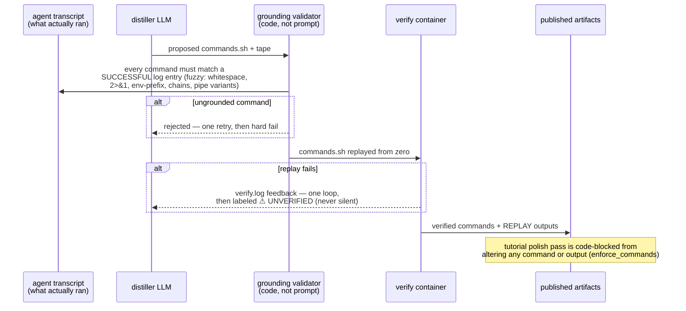

# readme2demo — Architecture

Three views: the pipeline, the trust boundaries, and the grounding rule that
makes the output trustworthy. Diagrams are Mermaid — GitHub renders them
natively.

## 1. Pipeline

Seven stages over a crash-safe manifest (`manifest.json`); every stage is
resumable (`readme2demo resume <run> [--from-stage <s>]`).

## 2. Containers & trust boundaries

The container is the security boundary; the LLM is never trusted.

\* hardened: `--cap-drop ALL`, `no-new-privileges`, memory/cpu/pids limits,
non-root user, wall-clock timeouts, destroyed after every stage.

Known MVP tradeoff: the engine credential enters the agent container
(dedicated low-limit key recommended); a host-side key-injecting egress proxy
is the planned fix.

## 3. The grounding rule (why the output can be trusted)

**The LLM never publishes anything a fresh container didn't independently
execute.** Enforced in code at four points — prompts are suggestions,
parsers are law.

## Module map

| Stage | Module | LLM? | Key invariant |
|---|---|---|---|
| ingest | `ingest.py` | planner call | infeasible repos fail for pennies, before any agent time |
| agent | `agent.py`, `engines/` | the agent itself | runs INSIDE the sandbox; guide mode = execute every step |
| normalize | `normalize.py` | no — pure | deterministic parsing; cheat/pattern/coverage checks live here |
| distill | `distill.py` | one call | grounding enforced in code; tape derived from step_by_step.md |
| verify | `verify.py` | no | fresh container, zero agent state; the only source of "✅ verified" |
| tutorial | `tutorial.py` | polish call | commands/outputs restored from verified data regardless of LLM output |
| render | `render.py` | no | video duration must cover the tape; incomplete video = hard fail |

Engines are plugins (`engines/base.py`): `claude-code` (default) and
`openhands` (experimental) both normalize to the same `command_log.json` —
nothing downstream knows which agent ran.
